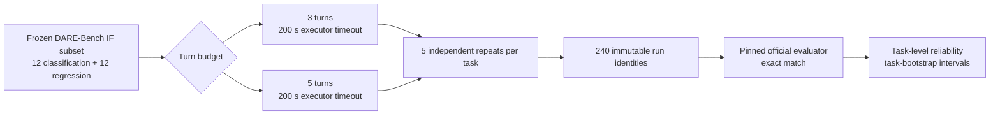

# Beyond Average Score: Repeatability of LLM Data-Science Agents on DARE-Bench

A reproducible 240-run study of exact-match performance and repeatability for an LLM data-science agent on a fixed DARE-Bench subset.

This is an independent reliability study built on [DARE-Bench](https://github.com/Snowflake-Labs/dare-bench). This repository is not a new benchmark, is not affiliated with Snowflake, and is not produced or endorsed by the DARE-Bench authors.

> **Research question:** When the same deterministic DARE-Bench instruction-following task is given to the same LLM agent repeatedly, how consistently does it succeed?

## Key result

Increasing the agent turn budget from three to five raised mean official exact-match success from **34.2%** to **50.0%** on this fixed 24-task subset. At the same time, flaky tasks increased from **29.2%** to **41.7%**, and mean pairwise disagreement rose from **15.0%** to **21.7%**. Additional turns improved average capability without uniformly improving repeatability.


The paired task-level mean difference was **+15.8 percentage points** (task-bootstrap 95% CI: +5.0 percentage points to +27.5 percentage points). This interval is descriptive; no formal significance claim is made.

## Study design



| Design element | Frozen value |
|---|---|
| DARE-Bench revision | `01447145304c67b861a004ada6d86f29640de61a` |
| Execution freeze | `94d1fe40d4a6569dcdb664c3e3f64f5738d49271` / `phase1-execution-freeze-v2` |
| Task variant | `question_v1` (IF) |
| Task sample | 12 Classification-IF + 12 Regression-IF |
| Selection seed | `20260825` |
| Subset SHA-256 | `2FA2F54C22265E04F3A39F2B8CFFA3DB12B58B508F2DF0C12940780ACA03C77E` |
| Model snapshot | `gpt-4.1-mini-2025-04-14` |
| Provider/API | `openai` / `chat_completions` |
| Agent conditions | 3 turns and 5 turns; 200 s executor timeout in both |
| Repetitions | 5 per task-condition |
| Planned and recorded runs | 24 × 5 × 2 = 240 |

The decoding and tool configuration was frozen before final execution: temperature `0.001`, top-p `0.8`, maximum output tokens `16384`, provider-default automatic tool choice, and function-call tool mode. Provider SDK retries remained at `2`; failed or incomplete study identities were never silently replaced.

## Method

### Tasks and agent

The sample was selected once from the pinned DARE-Bench evaluation release using seed `20260825`. Only `question_v1` Classification-IF and Regression-IF tasks were included. Each task was executed five times under each turn budget using `gpt-4.1-mini-2025-04-14` with the same prompt variant, sandbox, timeout, and decoding configuration.

The code sandbox was `dare-bench/sandbox-fusion:server-20250609-pyarrow20` at digest `sha256:fb4d7c91fa957391b331b4bc29377ddd2d04395fcb56e86db992e5b3519cb0fb`. Its relevant runtime was Python 3.10.18, pandas 2.2.0, NumPy 1.26.3, scikit-learn 1.4.0, and pyarrow 20.0.0. Captured host and container provenance is in [`results/environment/environment.json`](results/environment/environment.json). That manifest was recorded during preflight, so its embedded study-Git subsection predates the final execution freeze; the freeze commit and raw-run integrity report are authoritative for the code revision used by the final runs.

### Official evaluation

Reference outputs were generated locally with the pinned DARE-Bench `reference_solution.py` in the agent-compatible sandbox environment. Every produced `prediction.csv` was independently rescored with the pinned official `evaluation.py`. IF exact match is binary: a run passes only when the official final score is `1.0`. The integrity audit found 240 expected identities, 240 unique recorded identities, no missing or duplicate identities, 145 produced prediction files, and 145 verified prediction hashes. Runs that completed without producing a valid passing prediction remain failures.

### Reliability measures

For each task-condition, `always pass` means 5 passes, `never pass` means zero passes, and `flaky` means a mixture of pass and fail outcomes. Pairwise disagreement is the fraction of the 10 unordered repeat pairs with different binary outcomes. Confidence intervals resample tasks, not runs: 10,000 bootstrap resamples, seed `20260825`, and percentile 95 intervals.

## Results

### Official exact-match success

| Condition | Overall | Classification-IF | Regression-IF |
|---|---:|---:|---:|
| 3 turns | **34.2%** (41/120); 95% CI 18.3%–50.8% | 40.0% (24/60); CI 16.7%–63.3% | 28.3% (17/60); CI 8.3%–51.7% |
| 5 turns | **50.0%** (60/120); 95% CI 34.2%–65.8% | 61.7% (37/60); CI 40.0%–81.7% | 38.3% (23/60); CI 16.7%–60.0% |


Classification improved by **+21.7 percentage points** (descriptive 95% CI: +3.3 percentage points to +41.7 percentage points); regression improved by **+10.0 percentage points** (CI: 0.0 percentage points to +21.7 percentage points). Classification contributed 13 of the 19 additional exact-match passes (68.4%), compared with 6 additional regression passes. With only 12 tasks per family, this is a descriptive concentration, not evidence of a general task-family interaction.


### Repeatability

| Condition | Always-pass tasks | Flaky tasks | Never-pass tasks | Mean pairwise disagreement |
|---|---:|---:|---:|---:|
| 3 turns | 5/24 (20.8%) | 7/24 (29.2%) | 12/24 (50.0%) | 15.0% |
| 5 turns | 7/24 (29.2%) | 10/24 (41.7%) | 7/24 (29.2%) | 21.7% |


### Paired task movements

Across the 24 tasks, 9 improved, 2 declined, and 13 tied. The median task-level change was 0.0 percentage points because more than half the tasks tied. Individual movements ranged from -20 percentage points to +80 percentage points. The largest changes are listed for completeness, not as representative examples.


<details>
<summary>All paired task movements, grouped by outcome</summary>

#### Improved (9)

- `jiaoyouzhang_stock-pledge-defaults-prediction_class` (classification): 0% → 80% (+80 percentage points)
- `sahideseker_fraud-detection-in-transactions-dataset_class` (classification): 0% → 80% (+80 percentage points)
- `csourire_datos-morfolgicos-de-100-especies-de-hongos_class` (classification): 40% → 100% (+60 percentage points)
- `anirudhsub_twizzlerdata_class` (classification): 0% → 40% (+40 percentage points)
- `cyberevil545_youtube-videos-data-for-ml-and-trend-analysis_reg` (regression): 0% → 40% (+40 percentage points)
- `electromarine_steam-alternator-generator-log-2005-synthetic_reg` (regression): 0% → 40% (+40 percentage points)
- `rohansardar_linear-regression-synthetic-data_reg` (regression): 60% → 100% (+40 percentage points)
- `ayushmanyashaswi_car-data-small-dataset-good-for-learning_reg` (regression): 20% → 40% (+20 percentage points)
- `muhammadwaqas023_pipeline-dataset-in-oil-and-gas-sector_class` (classification): 80% → 100% (+20 percentage points)

#### Declined (2)

- `madhuraatmarambhagat_crop-recommendation-dataset_class` (classification): 100% → 80% (-20 percentage points)
- `digantabhattacharya_usa-house-price-index-and-macroeconomic-variables_reg` (regression): 60% → 40% (-20 percentage points)

#### Tied (13)

- `aaryanmavaninew_hyperparameter-tuned-crop-yield-ml-dataset_class` (classification): 0% → 0% (0 percentage points)
- `milapgohil_flavorsense-tastes-predicted-by-life-and-climate_class` (classification): 0% → 0% (0 percentage points)
- `prekshad2166_food-expiry-tracker_class` (classification): 40% → 40% (0 percentage points)
- `samikshadalvi_pcos-diagnosis-dataset_class` (classification): 100% → 100% (0 percentage points)
- `shankar3234_ping-pong-game-playing-dataset_class` (classification): 20% → 20% (0 percentage points)
- `willianoliveiragibin_europe-mothers_class` (classification): 100% → 100% (0 percentage points)
- `adilshamim8_predict-calorie-expenditure_reg` (regression): 100% → 100% (0 percentage points)
- `ayushmanyashaswi_gold-price-2000-rows-of-data-yashaswi_reg` (regression): 0% → 0% (0 percentage points)
- `brsahan_extensive-used-car-price-for-predictive-modeling_reg` (regression): 100% → 100% (0 percentage points)
- `jacopoferretti_wages-and-education-of-young-males-dataset_reg` (regression): 0% → 0% (0 percentage points)
- `nicolsvrancovich_el-ateneo-marketplace-books_reg` (regression): 0% → 0% (0 percentage points)
- `sautkin_cleaned-supercon-from-nims-rdf-1-2_reg` (regression): 0% → 0% (0 percentage points)
- `shahriarkabir_linear-performance-pricing-lpp-pricing-dataset_reg` (regression): 0% → 0% (0 percentage points)

</details>

### Failure analysis

Of 240 runs, 101 passed and 139 failed official exact match. Failure labels were assigned only when mechanically supported by preserved evaluator or log evidence:

- `code_error`: **94**
- `wrong_prediction_unclassified`: **42**
- `malformed_prediction`: **2**
- `max_turn_or_token_limit`: **1**

`wrong_prediction_unclassified` is the fallback when a structurally valid prediction scored zero and the logs did not support a more specific label. The two malformed predictions were official evaluator row-count mismatch diagnostics. These counts describe what the saved evidence supports; they do not establish why the model failed.


## API usage and cost

The 873 recorded provider requests used 2,260,610 tokens: 1,781,519 prompt tokens, including 1,061,120 cached prompt tokens, and 479,091 completion tokens. Recorded API cost was **$1.160817**: $0.497736 for three turns and $0.663081 for five turns. Cost is a study-execution measurement under the frozen pricing metadata, not a general cost estimate.

## Reproducibility

The main public audit files are:

- [`configs/task_subset.json`](configs/task_subset.json): frozen task identities and questions;
- [`configs/execution.yaml`](configs/execution.yaml): frozen provider, model, decoding, tool, timeout, sandbox, and pricing configuration;
- [`results/derived/runs.csv`](results/derived/runs.csv): one independently rescored row per immutable identity;
- [`results/derived/raw_run_integrity.json`](results/derived/raw_run_integrity.json): identity, hash, token, cost, model-ID, and rescore checks;
- [`results/derived/robustness_checks.json`](results/derived/robustness_checks.json): documentation claim cross-checks and all paired task movements;
- [`results/figures/manifest.json`](results/figures/manifest.json): figure inputs, source hashes, and generator version.

Raw provider traces and run directories remain preserved in the study archive under `results/raw/` and are intentionally excluded from Git by the repository policy. They were not altered during publication preparation.

To regenerate the statistical tables, robustness checks, figures, and documentation from the committed run table:

```powershell
python -m pip install -r requirements-analysis.txt

python src/reliability_metrics.py `
  --runs results/derived/runs.csv `
  --subset configs/task_subset.json `
  --out-dir results/derived `
  --expected-repeats 5 `
  --bootstrap-samples 10000 `
  --seed 20260825

python src/render_publication_docs.py
python src/generate_figures.py
python src/render_publication_docs.py --check
python -X utf8 -m unittest discover -s tests -v
```

The explicit UTF-8 mode is needed on Windows because the pinned upstream loader otherwise inherits the system text encoding for a UTF-8 task file. The benchmark workspace and pinned upstream code can be restored with `scripts/bootstrap.ps1` or `scripts/bootstrap.sh`. Re-running the paid benchmark is neither required nor performed by the publication pipeline.

## Limitations

- The study evaluates one model snapshot: `gpt-4.1-mini-2025-04-14`.
- The sample contains 24 fixed IF tasks, not the complete DARE-Bench evaluation set.
- Each task-condition has 5 repetitions, limiting precision for task-specific reliability.
- Only Classification-IF and Regression-IF are included; modeling and time-series families are outside scope.
- Results should not automatically generalize to other models, agent architectures, decoding configurations, execution environments, or DARE-Bench task families.
- Bootstrap intervals are descriptive task-resampling intervals. No formal significance claim is made.
- Failure taxonomy assignment is mechanical and evidence-limited. `wrong_prediction_unclassified` deliberately avoids unsupported causal attribution.
- Raw traces are locally preserved but are not part of the lightweight Git history, so the committed integrity and run tables are the public audit layer.

## License

The original code and documentation in this repository are licensed under the [Apache License 2.0](LICENSE). DARE-Bench remains governed by its [upstream license and dataset-specific licensing](https://github.com/Snowflake-Labs/dare-bench#license). No upstream benchmark databases or source datasets are redistributed here.

## Relationship to DARE-Bench

[DARE-Bench](https://openreview.net/forum?id=eJV3JhJvZF) evaluates modeling and instruction fidelity for LLM data-science agents using verifiable ground truth. This project uses its released tasks, reference-generation path, agent implementation, and official evaluator at pinned revision `01447145304c67b861a004ada6d86f29640de61a`. This study asks a narrower question: how repeatable is one agent on the same fixed tasks under two turn budgets?

This is an independent analysis. It does not modify or supersede DARE-Bench, does not constitute a new benchmark, and does not imply affiliation with Snowflake or the original authors.

### Citation

Please cite the original DARE-Bench paper alongside this repository:

```bibtex
@inproceedings{shu2026darebench,
  title     = {DARE-Bench: Evaluating Modeling and Instruction Fidelity of LLMs in Data Science},
  author    = {Shu, Fan and Wang, Yite and Wu, Ruofan and Liu, Boyi and Yao, Zhewei and He, Yuxiong and Yan, Feng},
  booktitle = {International Conference on Learning Representations},
  year      = {2026}
}
```

Repository citation metadata is provided in [`CITATION.cff`](CITATION.cff).
