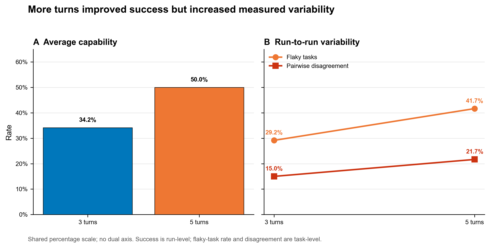
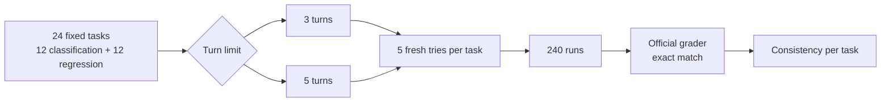
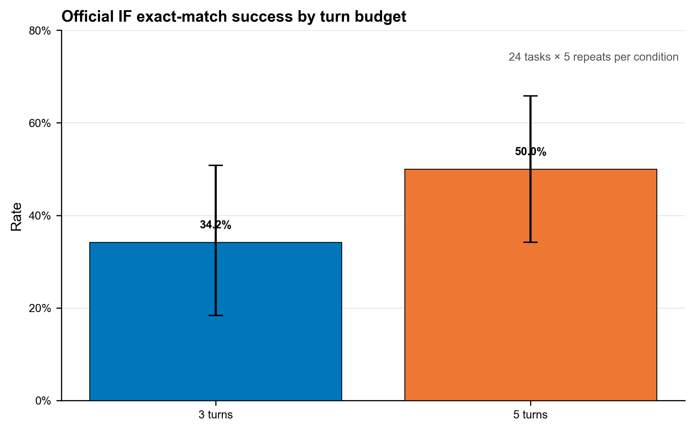
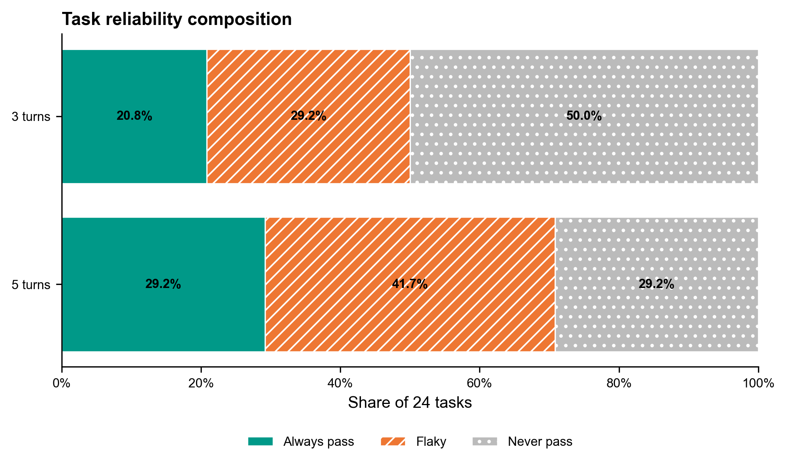
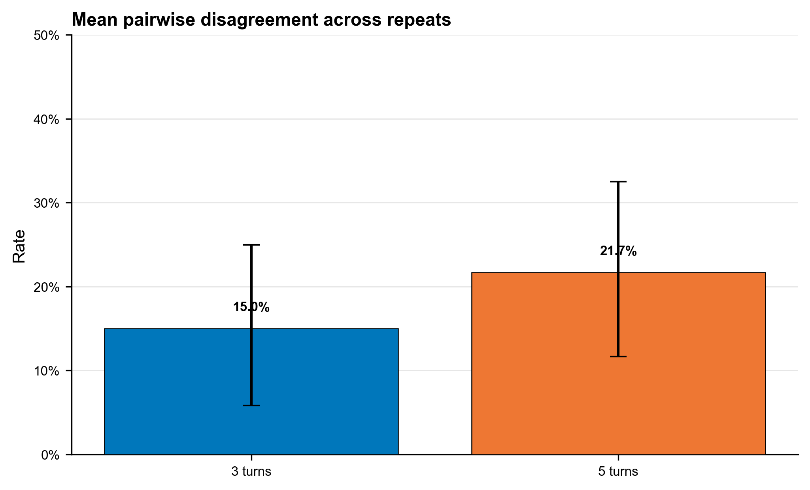
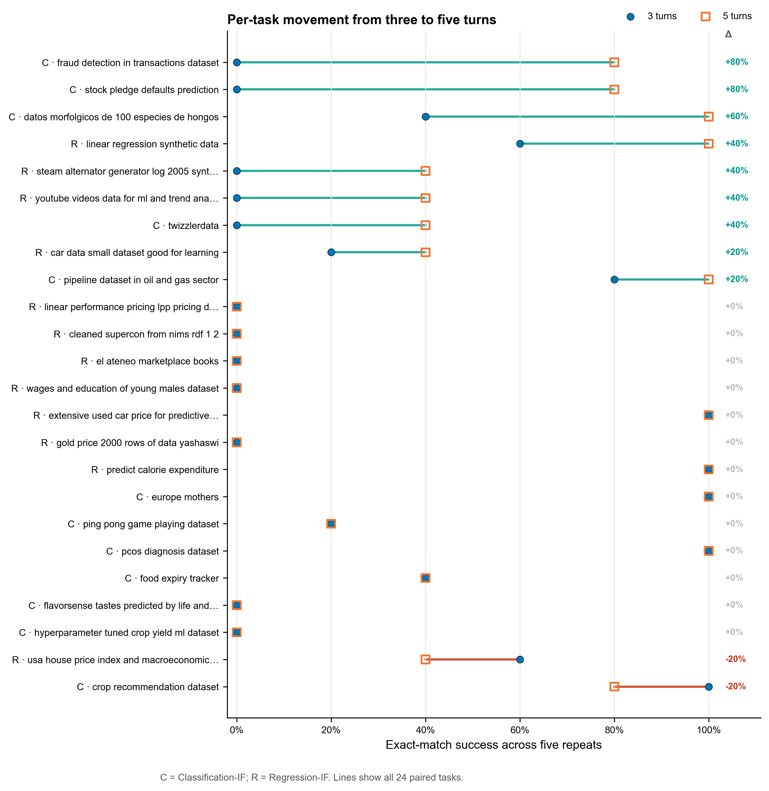
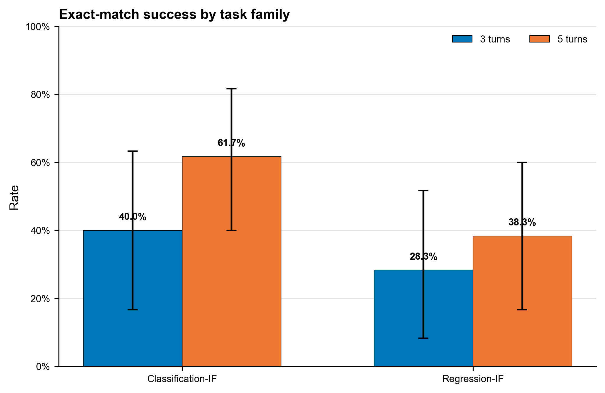
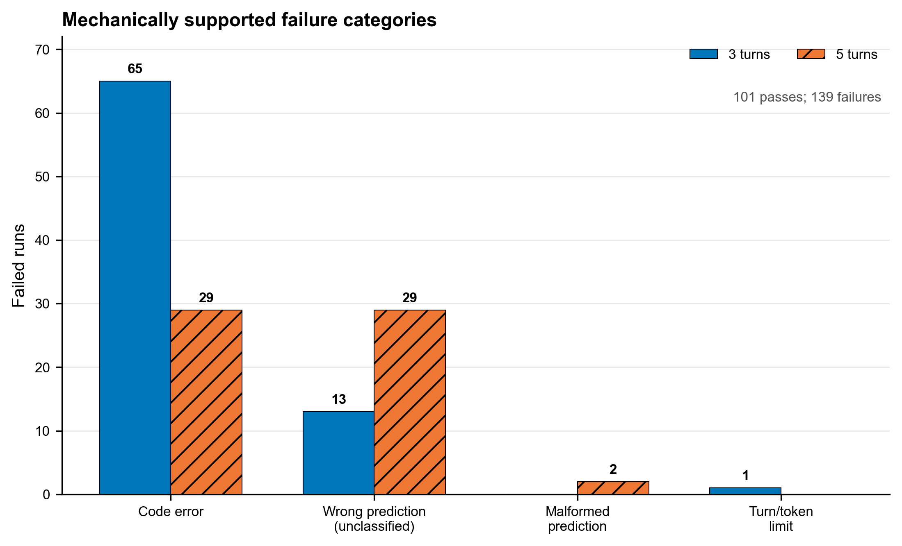

# Beyond Average Score: Repeatability of LLM Data-Science Agents on DARE-Bench

[](https://github.com/MouhssineElBoumshouli/dare-agent-reliability/actions/workflows/analysis.yml)

If you give an AI agent the same task 5 times, does it get the same result every time? This project tests that. It runs one AI agent on 24 data-science tasks from DARE-Bench, 5 times each, under two different turn limits. That's 240 runs in total.

This is an independent reliability study built on [DARE-Bench](https://github.com/Snowflake-Labs/dare-bench). It is not a new benchmark, and it is not made or endorsed by Snowflake or the DARE-Bench authors.

## The short version

Most AI benchmarks run each task once and report an average score. That score can hide a lot. A 50% score could mean the agent always solves half the tasks and never solves the rest. Or it could mean the agent solves every task about half the time. If you rely on the agent, those are very different.

So I gave the same agent the same tasks over and over. Think of a student who gets the same problem 5 times and starts fresh each time. First the student gets a short time limit (3 turns). Then a longer one (5 turns).

With more turns, the agent passed more often: **34.2%** of runs passed with 3 turns, and **50.0%** with 5. But it also got less predictable. Tasks with mixed results, where some tries pass and some fail, went from **7 to 10** out of 24. More turns made the agent better on average, but not more consistent.



## How the study worked

- **The tasks.** 12 classification tasks (predict a category) and 12 regression tasks (predict a number), picked at random from DARE-Bench with a fixed seed. These are instruction-following tasks. The instructions spell out every step, so there is exactly one correct answer.
- **The agent.** DARE-Bench's own agent code, unchanged, running OpenAI's `gpt-4.1-mini-2025-04-14`. It writes Python, runs it in a locked sandbox, reads the output, and tries again.
- **Turns.** One turn is one round of writing code, running it, and reading the result. The agent got either 3 or 5 turns per try. The code timeout was 200 seconds in both cases, so more turns didn't also mean more time per step.
- **Tries.** Each task got 5 separate tries per turn limit. Every try started from scratch, with no memory of the others.
- **Grading.** DARE-Bench's official grader. A try passes only if every prediction exactly matches the correct answer.

That's 24 tasks × 2 turn limits × 5 tries = **240 runs**.



I wrote the plan and picked the tasks before running anything, and saved both to Git first. The code for the runs was locked at one commit, and the runner refused to start from any other version. Each run was saved to its own folder that can't be overwritten. Failed runs were never re-run. Afterwards, every run was graded a second time from the saved files.

<details>
<summary>Exact settings</summary>

| Setting | Value |
|---|---|
| DARE-Bench version | `01447145304c67b861a004ada6d86f29640de61a` |
| Frozen study code | `94d1fe40d4a6569dcdb664c3e3f64f5738d49271` / tag `phase1-execution-freeze-v2` |
| Task variant | `question_v1` (instruction-following) |
| Task selection seed | `20260825` |
| Task list SHA-256 | `2FA2F54C22265E04F3A39F2B8CFFA3DB12B58B508F2DF0C12940780ACA03C77E` |
| Model | `gpt-4.1-mini-2025-04-14` via `openai` `chat_completions` |
| Decoding | temperature `0.001`, top-p `0.8`, max output tokens `16384` |
| Tools | function calls, provider-default tool choice |
| SDK retries | `2` per request, inside the same run |
| Sandbox | `dare-bench/sandbox-fusion:server-20250609-pyarrow20` at `sha256:fb4d7c91fa957391b331b4bc29377ddd2d04395fcb56e86db992e5b3519cb0fb` |
| Sandbox Python | Python 3.10.18, pandas 2.2.0, NumPy 1.26.3, scikit-learn 1.4.0, pyarrow 20.0.0 |

The temperature is 0.001 and not 0 because DARE-Bench's code treats 0 as "not set" and switches to 0.7. Using 0.001 keeps it as close to 0 as possible without changing their code. More detail is in [`docs/model_selection.md`](docs/model_selection.md) and [`docs/protocol.md`](docs/protocol.md).

</details>

## What I found

### How often the agent passed

| Turn limit | All tasks | Classification | Regression |
|---|---:|---:|---:|
| 3 turns | **34.2%** (41/120; CI 18.3%–50.8%) | 40.0% (24/60; CI 16.7%–63.3%) | 28.3% (17/60; CI 8.3%–51.7%) |
| 5 turns | **50.0%** (60/120; CI 34.2%–65.8%) | 61.7% (37/60; CI 40.0%–81.7%) | 38.3% (23/60; CI 16.7%–60.0%) |

"CI" is a 95% confidence interval. It shows the range the true value probably falls in. The ranges are wide because there are only 24 tasks. They come from resampling tasks 10,000 times (seed `20260825`).



### How consistent the agent was

For each task, I looked at its 5 tries and put it in one of three groups:

- **Always pass:** all 5 tries passed.
- **Never pass:** no tries passed.
- **Flaky:** some tries passed and some failed. You can't predict what you'll get.

I also measured **pairwise disagreement**. With 5 tries there are 10 ways to pick two of them. Disagreement is the share of those pairs where one try passed and the other failed.

| Turn limit | Always pass | Flaky | Never pass | Pairwise disagreement |
|---|---:|---:|---:|---:|
| 3 turns | 5/24 (20.8%) | 7/24 (29.2%) | 12/24 (50.0%) | 15.0% |
| 5 turns | 7/24 (29.2%) | 10/24 (41.7%) | 7/24 (29.2%) | 21.7% |





### Where the extra turns went

With 3 turns, 66 of 120 runs ended without the agent ever saving an answer file. With 5 turns, that dropped to 29. But wrong answers went up from 13 to 29. The extra turns mostly helped the agent finish, and many of the runs that finished were still wrong.

### Task by task

Out of 24 tasks, 9 did better with 5 turns, 2 did worse, and 13 stayed the same. The average change per task was +15.8 percentage points (95% CI: +5.0 percentage points to +27.5 percentage points). Classification changed by +21.7 percentage points and regression by +10.0 percentage points. With only 12 tasks of each type, that gap is a hint, not proof.





<details>
<summary>Every task, grouped by how it changed</summary>

#### Improved (9)

- `jiaoyouzhang_stock-pledge-defaults-prediction_class` (classification): 0% → 80% (+80 percentage points)
- `sahideseker_fraud-detection-in-transactions-dataset_class` (classification): 0% → 80% (+80 percentage points)
- `csourire_datos-morfolgicos-de-100-especies-de-hongos_class` (classification): 40% → 100% (+60 percentage points)
- `anirudhsub_twizzlerdata_class` (classification): 0% → 40% (+40 percentage points)
- `cyberevil545_youtube-videos-data-for-ml-and-trend-analysis_reg` (regression): 0% → 40% (+40 percentage points)
- `electromarine_steam-alternator-generator-log-2005-synthetic_reg` (regression): 0% → 40% (+40 percentage points)
- `rohansardar_linear-regression-synthetic-data_reg` (regression): 60% → 100% (+40 percentage points)
- `ayushmanyashaswi_car-data-small-dataset-good-for-learning_reg` (regression): 20% → 40% (+20 percentage points)
- `muhammadwaqas023_pipeline-dataset-in-oil-and-gas-sector_class` (classification): 80% → 100% (+20 percentage points)

#### Declined (2)

- `madhuraatmarambhagat_crop-recommendation-dataset_class` (classification): 100% → 80% (-20 percentage points)
- `digantabhattacharya_usa-house-price-index-and-macroeconomic-variables_reg` (regression): 60% → 40% (-20 percentage points)

#### No change (13)

- `aaryanmavaninew_hyperparameter-tuned-crop-yield-ml-dataset_class` (classification): 0% → 0% (0 percentage points)
- `milapgohil_flavorsense-tastes-predicted-by-life-and-climate_class` (classification): 0% → 0% (0 percentage points)
- `prekshad2166_food-expiry-tracker_class` (classification): 40% → 40% (0 percentage points)
- `samikshadalvi_pcos-diagnosis-dataset_class` (classification): 100% → 100% (0 percentage points)
- `shankar3234_ping-pong-game-playing-dataset_class` (classification): 20% → 20% (0 percentage points)
- `willianoliveiragibin_europe-mothers_class` (classification): 100% → 100% (0 percentage points)
- `adilshamim8_predict-calorie-expenditure_reg` (regression): 100% → 100% (0 percentage points)
- `ayushmanyashaswi_gold-price-2000-rows-of-data-yashaswi_reg` (regression): 0% → 0% (0 percentage points)
- `brsahan_extensive-used-car-price-for-predictive-modeling_reg` (regression): 100% → 100% (0 percentage points)
- `jacopoferretti_wages-and-education-of-young-males-dataset_reg` (regression): 0% → 0% (0 percentage points)
- `nicolsvrancovich_el-ateneo-marketplace-books_reg` (regression): 0% → 0% (0 percentage points)
- `sautkin_cleaned-supercon-from-nims-rdf-1-2_reg` (regression): 0% → 0% (0 percentage points)
- `shahriarkabir_linear-performance-pricing-lpp-pricing-dataset_reg` (regression): 0% → 0% (0 percentage points)

</details>

## What this does and doesn't show

- **Part of the rise in flakiness is built into the measure.** A task that never passes can't be flaky. 5 tasks went from never passing to passing sometimes, and all of them ended up flaky. So some of the rise comes from tasks getting better, not from the agent getting less stable. For someone using the agent, the result is the same: with 5 turns, 10 of 24 tasks give unpredictable results.
- **It doesn't explain why tries differ.** The temperature was almost zero, and results still changed from try to try. Small differences probably add up over several turns, but this study didn't test the cause.
- **The gain is not claimed as statistically significant.** The confidence intervals describe the data. No formal significance claim is made.

## Why runs failed

Of 240 runs, 101 passed and 139 failed. Each failure got a label from simple rules based on the saved logs and the grader's output:

- `code_error` (**94**): no answer file, and a Python error shows up in the log
- `wrong_prediction_unclassified` (**42**): a valid answer file with wrong predictions
- `malformed_prediction` (**2**): an answer file the grader could not line up with the reference
- `max_turn_or_token_limit` (**1**): the agent ran out of turns or tokens

These labels are rough. A run counts as a `code_error` if a Python error shows up anywhere in its log. Many of those runs probably hit an error, fixed it, and then ran out of turns. A better rule would separate those cases. The rules are in [`docs/failure_taxonomy.md`](docs/failure_taxonomy.md).



## Cost

The whole study made 873 API calls and used 2,260,610 tokens. It cost **$1.16**: $0.50 for 3 turns and $0.66 for 5 turns, at the prices saved in [`configs/execution.yaml`](configs/execution.yaml).

## Limitations

- One model: `gpt-4.1-mini-2025-04-14`.
- 24 tasks, not the whole DARE-Bench set, and only instruction-following classification and regression tasks.
- 5 tries per task, so a task's success rate can only be 0%, 20%, 40%, 60%, 80%, 100%.
- The results might not hold for other models, agents, settings, or task types.
- The failure labels are rough, as explained above.
- The raw agent logs are too large for this repo. The run table and integrity report in `results/derived/` are the public record.

## Check the numbers yourself

You don't need an API key or Docker to check the results. Every table, figure, and this README are built from [`results/derived/runs.csv`](results/derived/runs.csv), which has one row per run. The tests fail if any published number stops matching the data. GitHub runs these checks on Linux and Windows after every change.

```
python -m pip install -r requirements-analysis.txt
python -X utf8 src/render_publication_docs.py --check
python -X utf8 -m unittest tests.test_reliability_metrics tests.test_publication_artifacts -v
```

To rebuild everything from the run table instead:

```
python src/reliability_metrics.py --runs results/derived/runs.csv --subset configs/task_subset.json --out-dir results/derived --expected-repeats 5 --bootstrap-samples 10000 --seed 20260825
python src/render_publication_docs.py
python src/generate_figures.py
```

The published SHA-256 hashes were taken on Windows. [`.gitattributes`](.gitattributes) makes Git check out those files with the same line endings on every system, so the hashes match anywhere.

Key files:

- [`configs/task_subset.json`](configs/task_subset.json): the 24 tasks and their full instructions.
- [`configs/execution.yaml`](configs/execution.yaml): the frozen model, settings, and prices.
- [`results/derived/runs.csv`](results/derived/runs.csv): one re-graded row per run.
- [`results/derived/raw_run_integrity.json`](results/derived/raw_run_integrity.json): proof that all 240 runs are there, with no duplicates.
- [`results/derived/robustness_checks.json`](results/derived/robustness_checks.json): cross-checks of the numbers in this README.
- [`results/figures/manifest.json`](results/figures/manifest.json): which data each figure was drawn from.

To rerun the agent itself, you need Docker, an OpenAI API key, and the pinned DARE-Bench code. [`scripts/bootstrap.sh`](scripts/bootstrap.sh) or [`scripts/bootstrap.ps1`](scripts/bootstrap.ps1) sets that up.

## About DARE-Bench

[DARE-Bench](https://openreview.net/forum?id=eJV3JhJvZF) tests how well AI agents do data-science work, using tasks with answers that can be checked exactly. This project uses its tasks, reference answers, agent code, and official grader at version `01447145304c67b861a004ada6d86f29640de61a`. It asks a narrower question: how consistent is one agent on the same tasks?

This is an independent analysis. It does not change or replace DARE-Bench, is not a new benchmark, and does not imply affiliation with Snowflake or the original authors.

## License

The code and docs in this repo are under the [Apache License 2.0](LICENSE). DARE-Bench has its own [license and dataset licenses](https://github.com/Snowflake-Labs/dare-bench#license). No DARE-Bench databases or source datasets are copied here.

## Citation

If you use this work, please cite the DARE-Bench paper too:

```bibtex
@inproceedings{shu2026darebench,
  title     = {DARE-Bench: Evaluating Modeling and Instruction Fidelity of LLMs in Data Science},
  author    = {Shu, Fan and Wang, Yite and Wu, Ruofan and Liu, Boyi and Yao, Zhewei and He, Yuxiong and Yan, Feng},
  booktitle = {International Conference on Learning Representations},
  year      = {2026}
}
```

Citation details for this repo are in [`CITATION.cff`](CITATION.cff).
